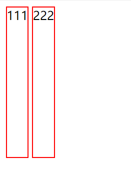

# css布局博客

## 左右布局

1. html默认的元素有两种，一种是块级元素block，一种是行内元素inline。块级元素默认占用文档流的一整行，行内元素根据元素内的内容决定宽度。所以要想左右布局，很自然的想法就是使用行内元素，但是行内元素不能设置高度，所以pass掉。这时候就可以采用一个css属性，display:inline block;这样的话既可以调节元素的高度，也可以放在一行。但是这样会出现一个问题，如图所示

   中间会有空隙就很讨厌，是因为源代码里两个inline-block之间有空格，这种情况我一般采用在inline-block的父元素上加上font-size=0来解决。还有要注意的一点就是inline-block可能会出现对不齐的情况，所以只要写inline-block就加上vertical-align:top就好了。

2. 采用float方法

   块元素float之后都会脱离文档流，就跟桶浮上水面一样，float有float:left和float:right两种，但float也可能会出bug，所以在float的父元素上面务必要加上clearfix类，具体代码是

   ```css
   clearfix::after{
       content: '';
       display: block;
       clear: both; 
   }
   ```

## 左中右布局

左中右布局的话同上，要么display:inline-block，要么float:left/right；

## 水平居中

水平居中的话分两种情况：块级元素还是内联/行内块元素

1. 块级元素

   因为块级元素是默认占一整行的，所以不存在居中一说。若想居中，就先指定块级元素的宽度`width=xxx`,再`margin: 0 auto`即可。

2. 内联元素/行内块元素

   给父元素加一条属性`text-align:center`即可

## 垂直居中

我现在会的垂直居中的方法还很简单，就是设置上下margin或padding一样就可以垂直居中了

其中值得注意的一点是，若设置行内元素中的字居中，并不一定要line-height等于父元素的块高，因为这样字的大小可能不是很满意，可以line-height等于一个适合的高度，再上下padding一样，总共加起来等于父元素的快高就好了
