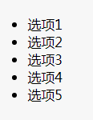

先把我的html结构亮出来

```html
<!DOCTYPE html>
<html>
<head>
  <meta charset="utf-8">
  <title>JS Bin</title>
</head>
<body>
<ul>
  <li>选项1</li>
  <li>选项2</li>
  <li>选项3</li>
  <li>选项4</li>
  <li>选项5</li>
</ul>
</ul>
</body>
</html>
```

</img>

就是这样

- 一开始没有思路，只能先封装个函数来实现以下功能，我实现的是getSiblings和addClass

```javascript
function getSiblings(node) {
    let children = node.parentNode.children;
    let siblings = { length: 0 };
    for (let i = 0; i < children.length; ++i) {
        if (children[i] !== node) {
            siblings[siblings.length++] = children[i];
        }
    }
    return siblings;
}
//{a:true.b:false,c:true}
function addClass(node, classes) {
    let temp = { true: "add", false: "remove" };
    for (key in classes) {
        node.classList[temp[classes[key]]](key);
    }
}
//这里的addClass支持同时删除和添加类
```

- 这样封装还是不行，就采用了命名空间的方式

```javascript
var fan = {}
fan.getSiblings = function (node) {
    let children = node.parentNode.children;
    let siblings = { length: 0 };
    for (let i = 0; i < children.length; ++i) {
        if (children[i] !== node) {
            siblings[siblings.length++] = children[i];
        }
    }
    return siblings;
}
fan.addClass = function (node, classes) {
    let temp = { true: "add", false: "remove" };
    for (key in classes) {
        node.classList[temp[classes[key]]](key);
    }
}
// console.log(fan.getSiblings(x));
// fan.addClass(x,{a:true,b:false,c:true});
```

但是采用命名空间的话使用不符合编程的习惯，要是能node.getSiblings就好了，于是想到了再Node.prototype里面改

- 扩展Node接口

```javascript
Node.prototype.getSiblings = function () {
    let children = this.parentNode.children;
    let siblings = { length: 0 };
    for (let i = 0; i < children.length; ++i) {
        if (children[i] !== this) {
            siblings[siblings.length++] = children[i];
        }
    }
    return siblings;
}
Node.prototype.addClass = function (classes) {
    let temp = { true: "add", false: "remove" };
    for (key in classes) {
        this.classList[temp[classes[key]]](key);
    }
}
//node.getSiblings()
```

这样虽然可以直接用节点来调用函数，但是会污染Node.prototype，干脆定义一个新的接口

- 直接定义一个新的接口

```javascript
function jQuery(node) {
    return {
        getSiblings: function () {
            let children = node.parentNode.children;
            let siblings = { length: 0 };
            for (let i = 0; i < children.length; ++i) {
                if (children[i] !== node) {
                    siblings[siblings.length++] = children[i];
                }
            }
            return siblings;
        },
        addClass:function(classes){
            let temp = { true: "add", false: "remove" };
            for (key in classes) {
            node.classList[temp[classes[key]]](key);
            }
        }
    }
}
window.$ = jQuery;
var node = $(x);
console.log(node)
console.log(node.getSiblings.call(undefined));
node.addClass.call(undefined,{a:true,b:false,c:true});
```

这样就跟jQuery很像啦，但是当我console.log(node)的时候我发现，只返回一个只有两个函数作为键值对的对象`{getSiblings:function(){...},addClass:function(){...}}`，这不符合我的需求呀，返回的对象里应该有结点呀，于是

- 采用闭包思想

```javascript
function jQuery(nodeOrSelector) {
    let nodes = {length:0}
    if(typeof nodeOrSelector === "string"){
        let dnodes = document.querySelectorAll(nodeOrSelector);
        for(let i = 0; i<dnodes.length; ++i){
            nodes[nodes.length++] = dnodes[i]
        }
    }
    else if(nodeOrSelector instanceof Node){
        nodes[nodes.length++] = Node;
    }
    nodes.addClass = function(classes){
        let temp = {true: "add", false: "remove"};
        for(let i = 0;i<nodes.length;++i){
            for(key in classes){
                nodes[i].classList[temp[classes[key]]](key);
            }
        }
    }
    nodes.text = function(newText){
        let arr = [];
        for(let i = 0;i<nodes.length;++i){
            if(newText === undefined)
                arr.push(nodes[i].textContent);
            else
                nodes[i].textContent = newText;                                     
        }
        return arr;
    }
    return nodes;
}
window.$ = jQuery;
var $nodes = $("ul>li");
console.log($nodes);
$nodes.addClass({a:true, b:false, c:true});
console.log($nodes.text("222"));
console.log($nodes.text());
```

这次直接在最顶层的jQuery函数里写一个nodes对象，采用闭包的思想返回nodes这个伪数组，终于就完美啦！